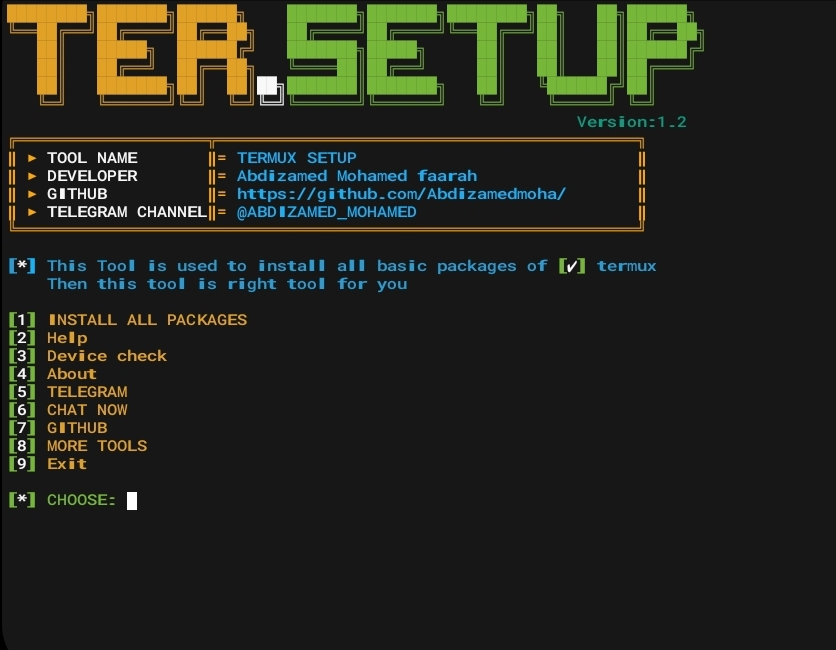

## Termux Setup Packages 

<p align="center">
  
</p>

---
<p align="center">
  
</p>
<div align="center">
  <pre style="display: inline-block; border: 1px solid; padding: 10px;">
████████╗███████╗███████╗████████╗██╗   ██╗██████╗ 
╚══██╔══╝██╔════╝██╔════╝╚══██╔══╝██║   ██║██╔══██╗
   ██║    ███████╗█████╗      ██║   ██║   ██║██████╔╝
   ██║    ╚════██║██╔══╝      ██║   ██║   ██║██╔═══╝ 
   ██║██╗███████║███████╗    ██║   ╚██████╔╝██║     
   ╚═╝╚═╝╚══════╝╚══════╝    ╚═╝    ╚═════╝ ╚═╝     
                                                   
                           
              
  .           TOOL NAME: Termux Setup Packages
  .               Coded By: ⛥Abdizamed moha⛥

  </pre>
</div>
 
<p align="center">
   
   <br>
  


---

<h3><p align="center">About This Tool</p></h3><br>

>Once you have successfully installed this tool, you will have access to all the essential packages and languages in Termux. This tool is absolutely perfect for you.


---
<h3><p align="center">REQUIREMENTS</p></h3>

 ●Network usage `500MB+`<br>
 ●Storage usage `1GB+`<br>
 
 ---
<h3><p align="center">Tested On</p></h3>
<br>
<b>●Termux</b>

---
 <h3><p align="center">Install In Termux </p></h3>

```
apt update 
```
```
apt upgrade 
```
```
apt install git
```
```
git clone https://github.com/Abdizamedmoha/termux-setup.git
```

```
cd termux-setup 
```

```
chmod +x *
```
```
bash setup.sh
```


<h4>After the setup </h4>

```
bash termux-setup.sh
```

---
 <h2><p align="center">SOME PACKAGES INFO</p></h2> 

<h4><p align="center">LANGUAGES</p></h4> <br>

```
• Python 
• Python2 
• Bash 
• Perl
• Golang
• PHP
• Python-pip 
```
---
<h4><p align="center">Useful Packages</p></h4> <br>

```
● hub: Command-line wrapper for git that makes you better at GitHub.
● wget: Commandline tool for retrieving files using HTTP, HTTPS and FTP.
● curl: Command line tool for transferring data with URL syntax.
● gdu: Fast disk usage analyzer with console interface written in Go.
● elvish: A friendly and expressive Unix shell.
● yarn: Fast, reliable, and secure dependency management.
● inxi: Full featured CLI system information tool.
● zip: Tools for working with ziping files.
● unzip: Tools for working with unzipping files
● gzip: Standard GNU file compression utilities.
● coreutils: Basic file, shell and text manipulation utilities from the GNU project.
● dnsutils: Clients provided with BIND.
● fish: The user-friendly command line shell.
● vim: Vi IMproved - enhanced vi editor.
● ruby: Dynamic programming language with a focus on simplicity and productivity.
● fm: A terminal based file manager.
● git: Fast, scalable, distributed revision control system.
● ipcalc: Calculates IP broadcast, network, Cisco wildcard mask, and host ranges.
● help2man: Conversion tool to create man files.
● calcurse: is a calendar and scheduling application for the command line.
● httrack: It allows you to download a World Wide Web site from the Internet.
● gotop: A terminal based graphical activity monitor inspired by gtop and vtop.
● proot: Emulate chroot, bind mount and binfmt_misc for non-root users.
● unrar: Tool for extracting files from .rar archives.
● nala: Commandline frontend for the apt package manager.
● bmon: Bandwidth monitor and rate estimator.
● irssi: Terminal based IRC client.
● cowsay: Program which generates ASCII pictures of a cow with a message.
```
---
<h2><p align="center">Issues</p></h2>

<p align="center">
  
</p>

>We highly encourage you to reach out to our dedicated support team in the event that you encounter any challenges or difficulties. Our team is readily available and committed to assisting you promptly, efficiently, and effectively, ensuring that every issue you face is carefully addressed and resolved to your utmost satisfaction. Rest assured that we are here to provide the necessary guidance and support, putting your needs first and ensuring your experience is as seamless and enjoyable as possible.

---
<h3><p align="center">⛥About Us☆</p></h3><br><p align="center">
  
</p>
 
As a dedicated member of the Somalian 🇸🇴 <b>Ed-SomTech </b>Team, we specialize in creating innovative tools for enhancing security and knowledge in the realms of information technology. Our repertoire includes exceptional tools for purposes such as phishing, brute force, and hacking, designed specifically for platforms like `Termux` and `Linux`We strive to empower individuals with cutting-edge solutions, enabling them to explore and understand the intricacies of `cybersecurity`.

---
<br>
<br>
<h5><p align="center">© Copyright <b>Abdizamed Mohamed</b></p></h5>
