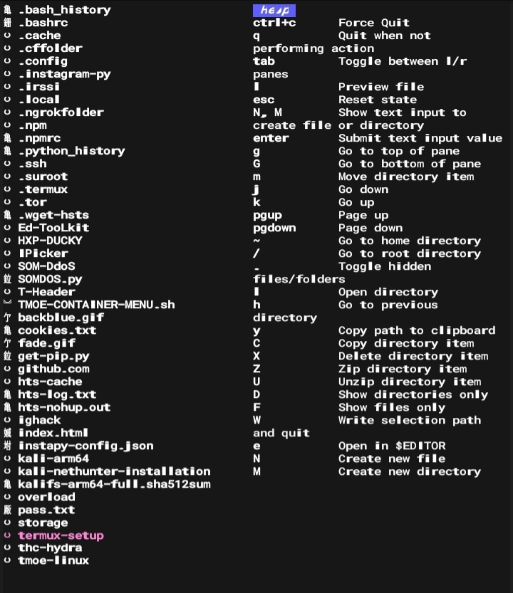

## Termux Setup Packages 


---
<p align="center">
  
</p>
<p align="center">
  
</p>
<div align="center">
  <pre style="display: inline-block; border: 1px solid; padding: 10px;">
████████╗███████╗███████╗████████╗██╗   ██╗██████╗ 
╚══██╔══╝██╔════╝██╔════╝╚══██╔══╝██║   ██║██╔══██╗
   ██║    ███████╗█████╗      ██║   ██║   ██║██████╔╝
   ██║    ╚════██║██╔══╝      ██║   ██║   ██║██╔═══╝ 
   ██║██╗███████║███████╗    ██║   ╚██████╔╝██║     
   ╚═╝╚═╝╚══════╝╚══════╝    ╚═╝    ╚═════╝ ╚═╝     
                                                   
                           
              
  .           TOOL NAME: Termux Setup Packages
  .               Coded By: ⛥Abdizamed moha⛥

  </pre>
</div>
 
<p align="center">
   
   <br>
  


---

<h3><p align="center">About This Tool</p></h3><br>

>Once you have successfully installed this tool, you will have access to all the essential packages and languages in Termux. This tool is absolutely perfect for you.


---
<h3><p align="center">REQUIREMENTS</p></h3>

 Network usage `500MB+`<br>
 Storage usage `1GB+`<br>
 
 ---

 <h5><p align="center">Termux</p></h3>

```
git clone https://github.com/Abdizamedmoha/termux-setup.git
```

```
cd termux-setup 
```

```
chmod +x *
```

```
bash setup.sh
```


<h4>Before the setup </h4>

```
bash termux-setup.sh
```

---
 <h3><p align="center">SOME PACKAGES</p></h3> 

<h4><p align="left">gotop</p></h4> <br><p align="center">
  
</p> <br>

---
<h4><p align="left">gdu</p></h4><p> Fast disk usage analyzer with console interface written in Go</p><p align="center">
  
</p> <br>

---
<h4><p align="left">fish</p></h4><p>The user-friendly command line shell</p><p align="center">
  
</p> <br>

---
<h4><p align="left">fm</p></h4><p>A terminal based file manager</p>
<p align="center">
  
</p> <br>

---
<h4><p align="left">nala</p></h4>use it instead of apt bcuz it have many features </p>
<p align="center">
  
</p> <br>

---
<h4><p align="left">hub</p></h4><p>Command-line wrapper for git that makes you better at GitHub</p>
<p align="center">
  
</p> <br>

---
<h4><p align="left">calcurse</p></h4><p>calcurse is a calendar and scheduling application for the command line</p>
<p align="center">
  
</p> <br>
 
 ---
 
<h3><p align="center">⛥About Us</p></h3><br>
 
As a dedicated member of the Somalian 🇸🇴 <b>Ed-SomTech </b>Team, we specialize in creating innovative tools for enhancing security and knowledge in the realms of information technology. Our repertoire includes exceptional tools for purposes such as phishing, brute force, and hacking, designed specifically for platforms like `Termux` and `Linux`We strive to empower individuals with cutting-edge solutions, enabling them to explore and understand the intricacies of `cybersecurity`.

<h2><p align="center">Issues</p></h2>

<p align="center">
  
</p>

>We highly encourage you to reach out to our dedicated support team in the event that you encounter any challenges or difficulties. Our team is readily available and committed to assisting you promptly, efficiently, and effectively, ensuring that every issue you face is carefully addressed and resolved to your utmost satisfaction. Rest assured that we are here to provide the necessary guidance and support, putting your needs first and ensuring your experience is as seamless and enjoyable as possible.

<br>
<br>
<br>
<h5><p align="center">© Copyright <b>Abdizamed Mohamed</b></p></h5>
